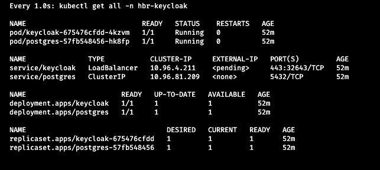

## Manual setup

* Apply the YAMLS in numerical order like:
```  
kubectl apply -f 01_namespace.yaml 
kubectl apply -f 02_secrets.yml
kubectl apply -f 03_storage.yml
kubectl apply -f 04_postgres.yml
kubectl apply -f 05_keycloak.yml
kubectl apply -f 06_ingress.yml
```
* Enter `watch -n 1 kubectl get all -n hbr-keycloak` to query the current state of deployments.



* Depending on your machine the deployment of all components will take a minute or two.

**Hint**: most values and names in these YAMLs are hard-coded. For a more flexible variant, check the alternative [Helm installation](../helm/README.md).
